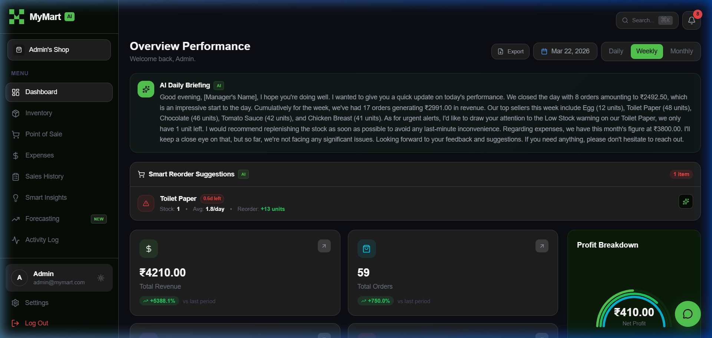
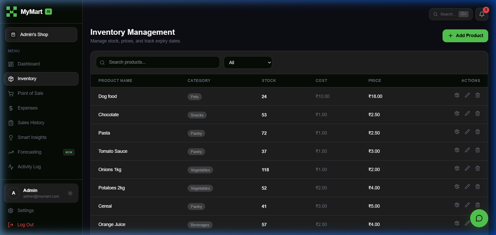
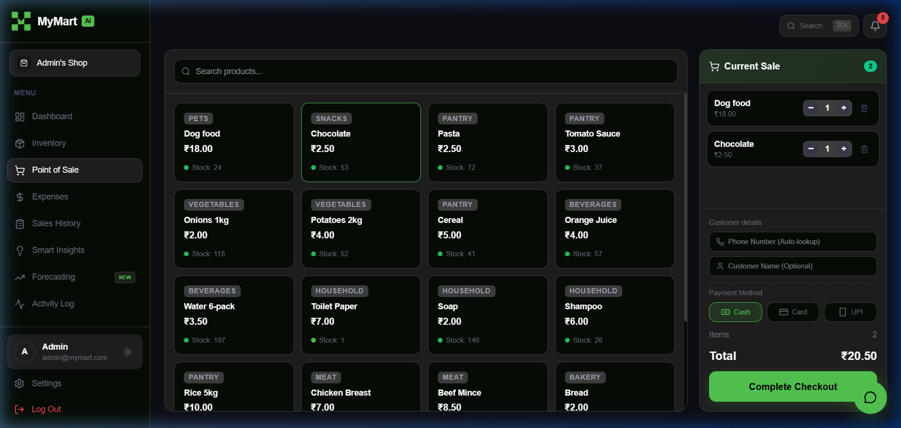
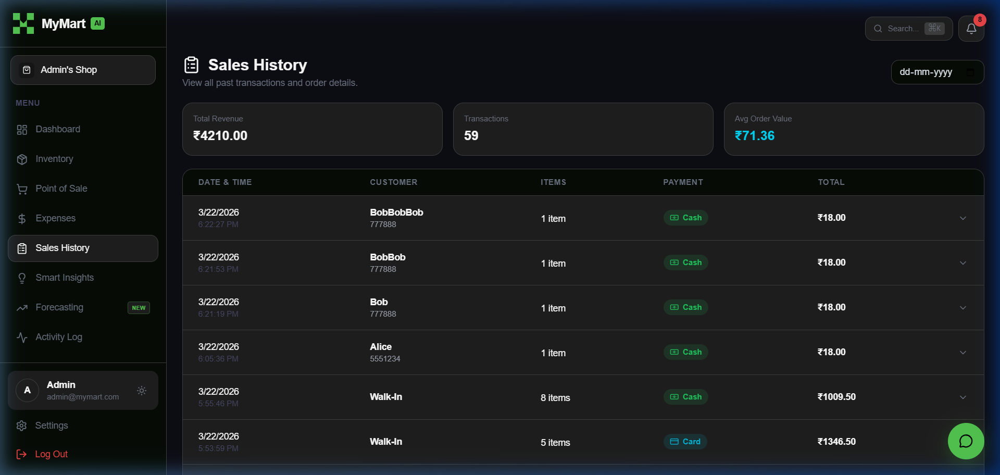

<p align="center">
  <h1 align="center">🛒 MyMart — AI-Powered Retail Intelligence Platform</h1>
  <p align="center">
    A full-stack supermarket management system with built-in AI analytics, demand forecasting, anomaly detection, and a smart reorder engine — powered by Groq AI.
  </p>
</p>

<p align="center">
  
</p>

---

## ✨ Features & Visuals

### 📊 Intelligent Dashboard
Real-time revenue, orders, profit, and trend charts alongside an **AI-generated Daily Briefing**.
<p align="center"></p>

### 📦 Smart Inventory Management
Add, edit, delete products with category filters, robust pagination, and dynamic low-stock alerts.
<p align="center"></p>

### 💳 Modern Point of Sale (POS)
Ultra-fast checkout process featuring customer recognition by phone number and thermal-printer ready smart receipts.
<p align="center"></p>

### 📋 Detailed Sales & Operations
Track every transaction and business expense with powerful search and customer history filtering capabilities.
<p align="center"></p>

---

### 🧠 Core System Operations
| Feature | Description |
|---|---|
| **Expenses** | Track and categorize business expenses meticulously |
| **Settings** | Manage Store Profile details, Security, and Global Currency Preferences |


### AI Intelligence Layer
| Feature | Description |
|---|---|
| **AI Chat Assistant** | Floating chat widget — ask anything about your store data in real time |
| **Daily Briefing** | AI-generated morning summary on Dashboard with timezone/currency awareness |
| **Demand Forecasting** | 4-week moving average with trend detection (rising/declining/stable) and risk assessment |
| **Anomaly Detection** | Detects sales spikes, inventory drops, unusual transactions, and stagnant stock |
| **Reorder Engine** | Calculates days-until-stockout and recommended reorder quantities with urgency levels |
| **Smart Insights** | Dead inventory detection, discount suggestions for near-expiry items, reorder alerts |
| **AI Explanations** | Natural-language AI explanations perfectly synced with your regional store currency |

### Premium UX
| Feature | Description |
|---|---|
| **Command Palette** | `Ctrl+K` to search pages, products, and actions instantly |
| **Notification Bell** | Real-time alerts for low stock, expiry, and anomalies |
| **Onboarding Tour** | 6-step guided walkthrough for first-time users |
| **Activity Log** | Full audit trail of all store actions |
| **Theme Toggle** | Dark/Light mode with persistence |
| **Export** | Dashboard export via browser print API |

---

## 🏗️ Tech Stack

| Layer | Technology |
|---|---|
| **Frontend** | React 19 · Vite · Tailwind CSS · Recharts · Lucide Icons |
| **Backend** | Node.js · Express 5 |
| **Database** | MongoDB Atlas (Mongoose ODM) |
| **AI Engine** | Groq API (LLaMA 3.1, Mixtral, Kimi) |
| **Auth** | JWT-based authentication (bcryptjs) |
| **Security** | Helmet · Rate limiting · CORS |

---

## 📁 Project Structure

```
MyMart/
├── backend/
│   ├── config/           # MongoDB connection + event listeners
│   ├── controllers/      # HTTP handlers (validation + orchestration)
│   │   ├── aiController.js        # AI chat, briefing, explain
│   │   ├── anomalyController.js   # Anomaly detection + AI explain
│   │   ├── forecastController.js  # Demand forecasting + AI explain
│   │   ├── reorderController.js   # Reorder recommendations + AI explain
│   │   ├── insightController.js   # Smart insights
│   │   ├── dashboardController.js # Dashboard stats & charts
│   │   ├── productController.js   # Product CRUD
│   │   ├── saleController.js      # Sales + POS
│   │   ├── expenseController.js   # Expense tracking
│   │   ├── authController.js      # Register/Login/Password
│   │   └── activityController.js  # Activity audit log
│   ├── intelligence/     # Pure analytical engines (no DB, no HTTP)
│   │   ├── forecastEngine.js      # Demand forecasting math
│   │   ├── anomalyEngine.js       # Anomaly detection rules
│   │   ├── reorderEngine.js       # Reorder calculations
│   │   ├── insightEngine.js       # Store analytics
│   │   └── aiNarrativeEngine.js   # All AI prompts & API calls
│   ├── middleware/       # Auth middleware, error handling
│   ├── models/           # Mongoose schemas (User, Product, Sale, Expense, ActivityLog)
│   ├── routes/           # Express route definitions
│   ├── services/         # AI service (Groq client init, store context builder)
│   ├── .env              # Environment variables (API keys, DB URI)
│   └── server.js         # Express app entry point
├── frontend/
│   ├── src/
│   │   ├── components/   # Reusable UI components
│   │   │   ├── AIChatWidget.jsx        # Floating AI chat
│   │   │   ├── CommandPalette.jsx      # Ctrl+K search
│   │   │   ├── NotificationBell.jsx    # Alert notifications
│   │   │   ├── OnboardingTour.jsx      # First-time user guide
│   │   │   ├── ReorderRecommendations.jsx # Dashboard reorder cards
│   │   │   ├── Sidebar.jsx             # Navigation sidebar
│   │   │   ├── Layout.jsx              # App layout wrapper
│   │   │   ├── ToastProvider.jsx       # Toast notifications
│   │   │   ├── ConfirmModal.jsx        # Confirmation dialogs
│   │   │   └── ErrorBoundary.jsx       # Error boundary
│   │   ├── context/      # React context providers
│   │   │   ├── AuthContext.jsx         # Authentication state
│   │   │   └── ThemeContext.jsx        # Dark/Light theme
│   │   ├── pages/        # Route-level pages
│   │   │   ├── Dashboard.jsx     # Overview with charts + AI briefing
│   │   │   ├── Inventory.jsx     # Product management
│   │   │   ├── POS.jsx           # Point of Sale checkout
│   │   │   ├── Expenses.jsx      # Expense tracker
│   │   │   ├── SalesHistory.jsx  # Transaction history
│   │   │   ├── Insights.jsx      # Smart analytics
│   │   │   ├── Forecasting.jsx   # Demand forecasting
│   │   │   ├── ActivityLog.jsx   # Audit trail
│   │   │   ├── Settings.jsx      # Profile & password
│   │   │   ├── Login.jsx         # Login page
│   │   │   └── Register.jsx      # Registration page
│   │   ├── services/
│   │   │   └── api.js            # Axios API client
│   │   ├── App.jsx               # Route definitions
│   │   └── main.jsx              # React entry point
│   └── index.html
└── README.md
```

---

## 🚀 Getting Started

### Prerequisites
- **Node.js** v18+
- **MongoDB** — [MongoDB Atlas](https://www.mongodb.com/atlas) (free tier) or local instance
- **Groq API Key** — [Get free key](https://console.groq.com/keys)

### 1. Clone & Install

```bash
git clone <your-repo-url>
cd MyMart

# Install dependencies for root, frontend, and backend all at once
npm run install-all
```

### 2. Configure Environment

Create `backend/.env`:

```env
PORT=5000
MONGODB_URI=your_mongodb_connection_string
JWT_SECRET=your_secret_key
GROQ_API_KEY=your_groq_api_key
GROQ_MODEL=llama-3.1-8b-instant
```

> **Supported models:** `llama-3.1-8b-instant`, `llama-3.1-70b-versatile`, `llama-3.3-70b-versatile`, `mixtral-8x7b-32768`, `moonshotai/kimi-k2-instruct-0905`

### 3. Seed Database (Optional)

```bash
cd backend
node seed.js
```

This creates sample products, sales, and expenses, plus a default admin account.

### 4. Run the Application

The application leverages Concurrently to run both the frontend and backend servers together in a single terminal.

```bash
# From the root MyMart directory:
npm run dev
```

*(Frontend runs on http://localhost:5173, Backend on http://localhost:5000)*

### 5. Login

Default admin credentials (from seed):
- **Email:** `admin@mymart.com`
- **Password:** `password123`

---

## 🧠 Architecture — Intelligence Layer

```
HTTP Request
  → Controller (validation + DB queries)
    → Intelligence Engine (pure computation)
      → aiNarrativeEngine (Groq AI prompts)
    ← Structured result
  ← JSON Response
```

Controllers contain **zero analytical logic**. All computation lives in `backend/intelligence/` as pure, unit-testable functions. AI narratives are generated server-side using a single Groq API key — no per-user configuration needed.

---

## 📡 API Endpoints

### Auth
| Method | Endpoint | Description |
|---|---|---|
| POST | `/api/auth/register` | Register new user |
| POST | `/api/auth/login` | Login, returns JWT token |
| PUT | `/api/auth/password` | Change password |

### Products
| Method | Endpoint | Description |
|---|---|---|
| GET | `/api/products` | List all products |
| POST | `/api/products` | Add product |
| PUT | `/api/products/:id` | Update product |
| DELETE | `/api/products/:id` | Delete product |

### Sales
| Method | Endpoint | Description |
|---|---|---|
| GET | `/api/sales` | Sales history |
| POST | `/api/sales` | Create sale (POS checkout) |

### Expenses
| Method | Endpoint | Description |
|---|---|---|
| GET | `/api/expenses` | List expenses |
| POST | `/api/expenses` | Add expense |
| PUT | `/api/expenses/:id` | Update expense |
| DELETE | `/api/expenses/:id` | Delete expense |

### AI Features
| Method | Endpoint | Description |
|---|---|---|
| POST | `/api/ai/chat` | AI chat assistant |
| GET | `/api/ai/briefing` | Daily AI briefing |
| POST | `/api/ai/explain` | AI explanation for insights |

### Intelligence & Analytics
| Method | Endpoint | Description |
|---|---|---|
| GET | `/api/forecast` | Demand forecasts with risk levels |
| POST | `/api/forecast/explain` | AI forecast explanation |
| GET | `/api/anomalies` | Detected anomalies |
| POST | `/api/anomalies/explain` | AI anomaly explanation |
| GET | `/api/reorder/recommendations` | Reorder suggestions |
| POST | `/api/reorder/explain` | AI reorder explanation |
| GET | `/api/insights` | Smart insights (dead stock, discounts, reorders) |
| GET | `/api/dashboard` | Dashboard stats, charts, trends |
| GET | `/api/activity` | Activity audit log |

---

## 🔒 Security

- **Authentication:** JWT tokens on all protected routes
- **Password Hashing:** bcryptjs with salt rounds
- **Security Headers:** Helmet middleware
- **Rate Limiting:**
  - General: 500 requests / 15 min
  - Auth: 20 requests / 15 min (brute-force protection)
  - AI: 60 requests / 15 min
- **CORS:** Enabled via cors middleware
- **Input Validation:** express-validator

---

## 🛠️ Available Scripts

### Backend
| Script | Command | Description |
|---|---|---|
| Start | `npm start` | Run server |
| Dev | `npm run dev` | Run server (development) |
| Seed | `node seed.js` | Seed database with sample data |

### Frontend
| Script | Command | Description |
|---|---|---|
| Dev | `npm run dev` | Start Vite dev server |
| Build | `npm run build` | Production build |
| Preview | `npm run preview` | Preview production build |

---

## 📄 License

MIT
